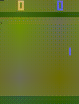
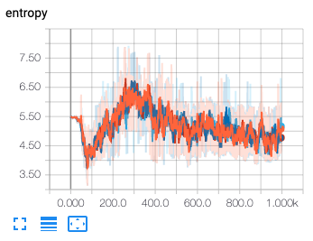
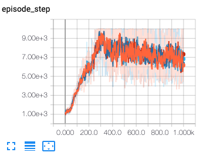
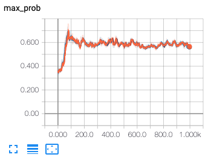
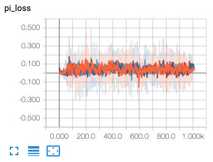
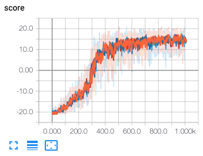
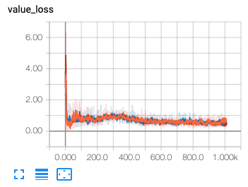

# Implementation of A3C(Asynchronous Advantage Actor-Critic)

* Asynchronous Advantage Actor-Critic()
* Tensorflow Implementation
* With one hour training gif

  

  
  

# Reference

* [Asynchronous Advantage Actor-Critic](https://arxiv.org/abs/1602.01783)
* [https://github.com/kkweon/A3C-Tensorflow](https://github.com/kkweon/A3C-Tensorflow)
* [https://github.com/rlcode/reinforcement-learning-kr](https://github.com/rlcode/reinforcement-learning-kr)